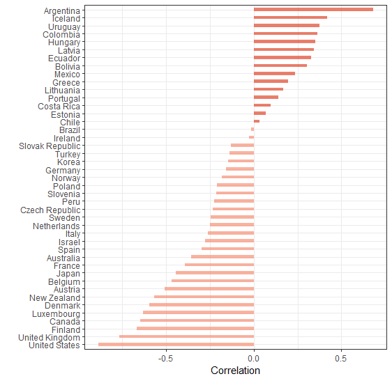
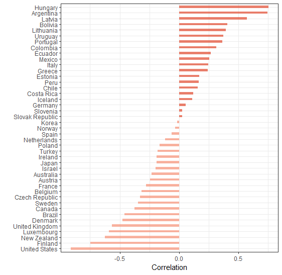
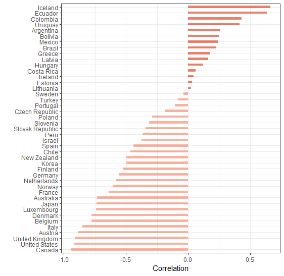
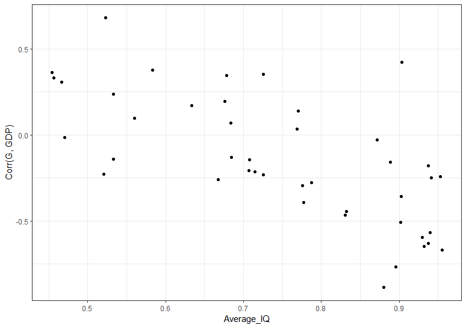
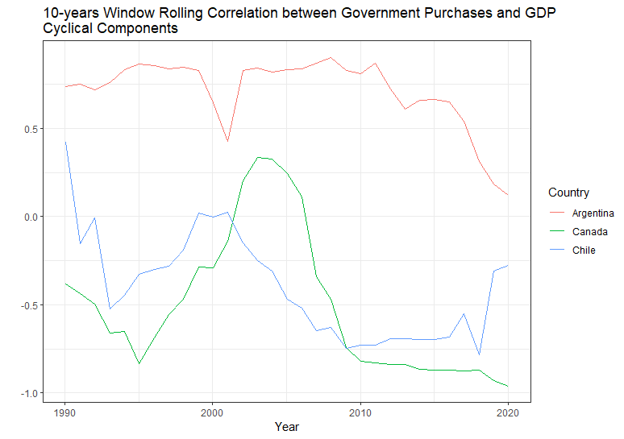
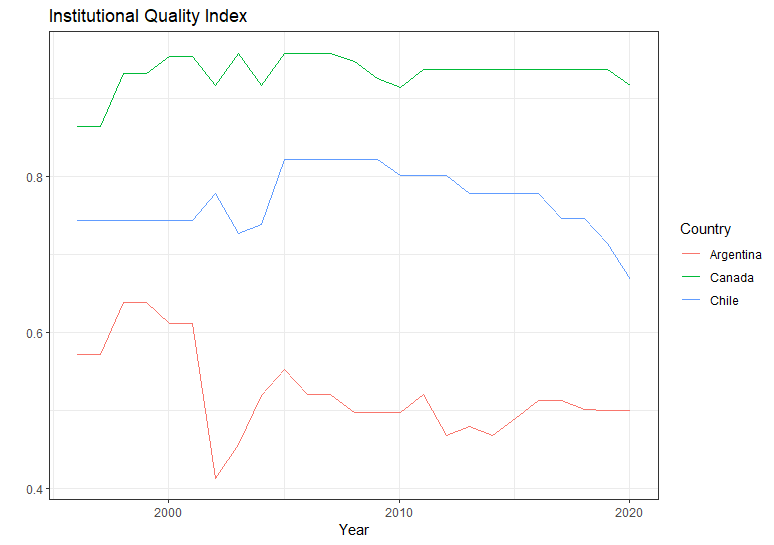
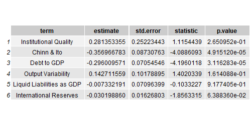
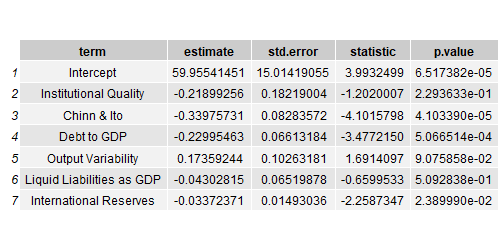
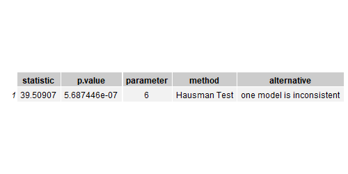

  This work is licensed under a <a rel="license" href="http://creativecommons.org/licenses/by/4.0/">Creative Commons Attribution 4.0 International License</a>.

Repository for the project: replicating the paper by Frankel, Végh & Vuletin (2011).

## Description of this project

This projects follows Frankel, Végh & Vuletin (2011) in most regards but it is not identical. Main difference is: I use a much smaller sample of countries - mostly rich, industrialized nations and some latin american countries.\
The purpose of the current project is to extend the analysis to account for the new availability of data, because it has been a decade since the paper was published. Observing and studying the cyclicality of fiscal policy is important because, in theory, the welfare maximizing strategy is for an agent to smooth consumption over time. The government is a particular agent in the economy mainly, but not only, due to its size. Therefore, its actions impact many more agents than would any, or most, other households or firms decisions.

## The Data

The main data source is the World Economic Outlook database published by the IMF on a biannual basis. Also, some data from other sources are included. Mainly, I used a free sample from the International Country Risk Guide which, although lacking most years, contained enough data to  explore the important features of the paper.\
I work on data regarding real gross domestic product and the level of government purchases in local currency units. Also, the data is extended to cover more variables to be used in regression analysis. \
One important such variable is the Institutional Quality index, IQ, also used in the paper. It is constructed as the mean of four normalized variables from the International Country Risk Guide: Corruption, Law and Order, Investment profile, Bureaucratic quality. I gathered a free sample and, thus, worked with a smaller database than the one used in the paper. \
I included data from a study of the Argentine Finance Ministry to extend figures on government spending for that country (https://www.economia.gob.ar/onp/documentos/series/Serie6506.pdf). The Australian Bureau of Statistics has an archive of Budget Statement and Speeches containing details of government spending which helped expand this country's figures. Data on government spending was found for Chile in Díaz, Lüders, & Wagner (2016); Ecuador in a publication by the Country's Central Bank; Costa Rica in public database by the Universidad de Costa Rica; Uruguay in a database by the Instituto de Economía of the Universidad de la República.

## Data Exploration

The way to measure fiscal policy cyclicality with respect to the business cycle is to, first, compute the cycle component of the series of interest and calculate their correlation coefficient. The correlation is computed for the data points covering the range of all years available for each country.

Although few exceptions are to be found, most developed nations are counter-cyclical and developing ones are pro-cyclical. Argentina stands as the most pro-cyclical country in the sample, and the United States are the most counter-cyclical. A few countries stand as a-cyclical such as Brazil, Ireland and Chile for the whole period under observation. To continue we are going to divide our data into two subperiods. One period will contain data points previous to the great Recession of 2008, and the second one will contain data for the subsequent decade.

During this period most Latin American countries stand as pro-cyclical with the exception of Brazil. The developed nations, led by the US, are counter-cyclical for the most part. Italy, Hungary and Greece are some example of high-income, developed countries with pro-cyclical fiscal policies.

For the second period it is possible to observe a significant shift in the degree of cyclicality for some countries. Brazil, for example, became pro-cyclical; while others became counter-cyclical, Chile being a leading example but Italy, also, accomplished that feature. Iceland stands as the most pro-cyclical country in the last decade, followed by Ecuador.

Author's interest in writing the paper was to analyse the importance of institutions in explaining and determining the presence of fiscal policy decisions. First, it is illustrative to elaborate a scatter plot to glance at a potential relation between the two variables - the quality of institutions and the cyclicality of fiscal policy.

As can be seen, there appears to be a negative relation between the variables. The higher the average institutional quality index for the country, the more counter-cyclical it is going to be.In the section of statistical modelling a regression analysis will be presented, whereby models will be fit in order to better grasp the influence of institutional quality on fiscal policy. To further explore the same idea from the graph we may want to glance at some countries individually.

As it can be seen in the graph, Argentina stands as the most pro-cyclical countries among the three selected. Chile and Canada are counter-cyclical according to the calculation. Chile began being pro-cyclical but quickly became counter-cyclical, while Canada remained counter-cyclical for most of the period but it was pro-cyclical around the 2000's. We want to juxtapose this graph to another displaying the evolution of the IQ index.

After considering both figures 5 & 6, we see that it is the case that Argentina is the most pro-cyclical country and also exhibits the lowest institutional quality index. Chile and Canada have adopted counter-cyclical policies for the most part and both exhibit higher values for the IQ index. This points to a significant effect of institutional quality in the direction of fiscal policies.

## Statistical Analysis
The original paper present the results of fixed effects regression models. Not all the variables used in the original paper were found and the models presented had interaction terms that I do not include. Nonetheless, I attempt to replicate the same result, namely, the the quality of institutions matter in determining the cyclicality of fiscal policy.

Results from the fixed effects model: 

Results for the random effects model:

Either the model specification or difference in data availability with respect to the original paper may explain the fact the in my data, with model, no significant effect of institutional quality was found. The magnitude and direction may be what we had hoped for, the the p value is large enough (0.2293) to make impossible to reject the null hypothesis of statistical equality to 0.

A key difference between estimators from a fixed effects models and a random effects one is that fixed effects are consistent whereas random effects are more efficient. Consistency ensures that our estimator will tend in probability to the true population coefficient as the sample size increases. Efficiency means that the confidence intervals for the estimator will be smaller but the estimator may well be biases.

The Hausman-Wu test tell us whether the two models' coefficients are statistically the same. If they are, then we must choose random effects. If they're not, then we must choose fixed effects.

Conclusion from the Hausman-Wu test is that the fixed effects model must prevail.

## All References

  
   Banco Central del Ecuador. (2017). Noventa Años del Banco Central del Ecuador Series Estadísticas Históricas.

  
   Díaz, J.; Lüders. R. y Wagner, G. (2016) "Chile 1810 – 2010. La República en cifras. Historical statistics." Santiago: Ediciones Universidad Católica de Chile

  
   Frankel, J. & Végh, C. & Vuletin, G. (2011). On Graduation From Fiscal Policy. NBER Working Papaer 17619

  
   Ministerio de Economía y Producción; Secretaría de Hacienda. (2007). PRESUPUESTO DE LA ADMINISTRACION NACIONAL: Gastos por Finalidad - Función y Naturaleza Económica 1965 - 2006. https://www.economia.gob.ar/onp/documentos/series/Serie6506.pdf

  
   Universidad de Costa Rica (n.d) Estadísticas Históricas En Costa Rica. https://iice.ucr.ac.cr/compendioxx/

